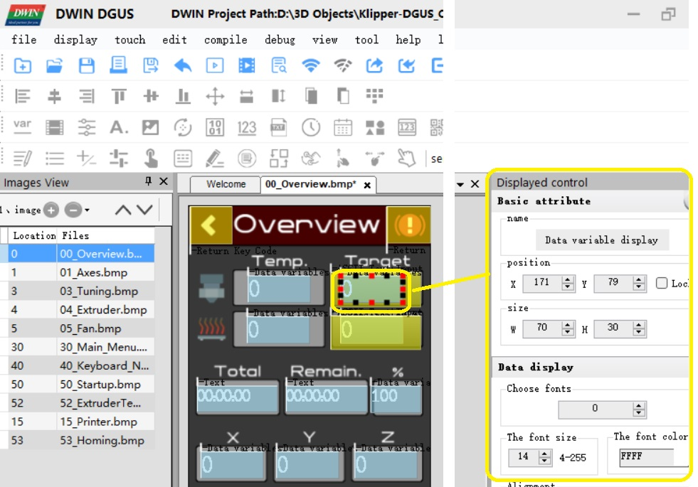

.. _14ShowFile.BIN:

**************
14ShowFile.BIN
**************

The file 14ShowFile.BIN contains the information telling DGUS what graphics to display.

The data in this file is entered into the DGUSTool as each display control is defined as an overlay on the screenmap.

14ShowFile.BIN is generated by the DGUSTool "generate" command and must be flashed to the display in DWIN_SET.

.. figure:: ../../img/File-generate.jpg