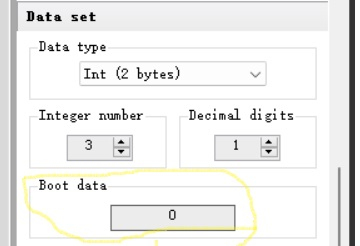
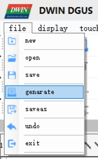

.. _22_Config.BIN:

**************
22_Config.BIN
**************

The file 22_Config.BIN contains any values that are configured as "boot data" in the DGUSTool project file.

22_Config.BIN is generated by the DGUSTool "generate" command and must be flashed to the display in DWIN_SET.

Flashing T5LCFG_272480K.CFG to the display when installing the DGUS application, configures the display to load 22_Config.BIN when the display powers-up.